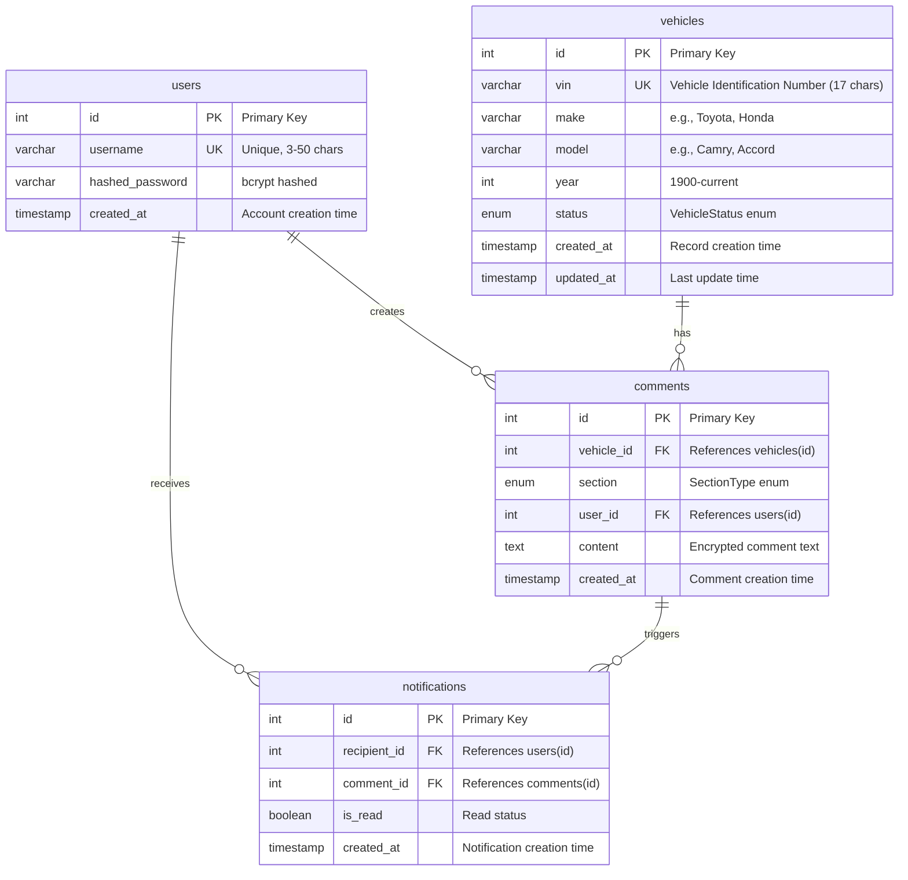

## Enum Types

### VehicleStatus
```
- PENDING: Initial state, vehicle just entered system
- ONLINE_EVALUATION: Vehicle in online evaluation phase (sections 1-3)
- INSPECTION: Vehicle in physical inspection phase (sections 4-5)
- COMPLETED: Evaluation completed successfully
- REJECTED: Vehicle rejected from inventory
```

### SectionType
```
Online Evaluation Sections (1-3):
- TIRE: Tire condition evaluation
- WARRANTY: Warranty status and coverage
- ACCIDENT_DAMAGES: Accident history and damages

Inspection Sections (4-5):
- PAINT: Paint condition inspection
- PREVIOUS_OWNERS: Previous ownership history
```

## Relationships

### One-to-Many Relationships

1. **users → comments**
   - One user can create many comments
   - Each comment belongs to one user (author)
   - Cascade: Comments remain if user is deleted (for audit trail)

2. **users → notifications**
   - One user can receive many notifications
   - Each notification is for one user (recipient)
   - Cascade: Notifications deleted when user is deleted

3. **vehicles → comments**
   - One vehicle can have many comments across all sections
   - Each comment is tied to one vehicle
   - Cascade: Comments deleted when vehicle is deleted

4. **comments → notifications**
   - One comment can trigger multiple notifications (multiple @mentions)
   - Each notification links to one comment
   - Cascade: Notifications deleted when comment is deleted

## Indexes

### Primary Indexes
- `users.id` (Primary Key, Auto-increment)
- `vehicles.id` (Primary Key, Auto-increment)
- `comments.id` (Primary Key, Auto-increment)
- `notifications.id` (Primary Key, Auto-increment)

### Unique Indexes
- `users.username` (Unique constraint)
- `vehicles.vin` (Unique constraint)

### Foreign Key Indexes
- `comments.vehicle_id` (For JOIN performance)
- `comments.user_id` (For JOIN performance)
- `comments.section` (For filtering by section)
- `notifications.recipient_id` (For user's notifications)
- `notifications.comment_id` (For comment's notifications)

## Security Features

### Encryption
- `comments.content` - Encrypted using Fernet (symmetric encryption)
- Encryption key stored in environment variable `ENCRYPTION_KEY`

### Authentication
- `users.hashed_password` - bcrypt with salt rounds
- JWT tokens for API authentication
- Token expiry: 30 minutes

### Validation
- Username: 3-50 chars, alphanumeric + underscore/hyphen
- Password: Min 8 chars, requires uppercase, lowercase, digit
- VIN: Exactly 17 chars, valid VIN format
- Year: 1900 to current year + 1

## Data Flow Example

### Comment with @mention Flow

```
1. Employee Alice creates comment on Vehicle #1, Section "tire"
   INSERT INTO comments (vehicle_id=1, section='tire', user_id=alice_id, content=encrypted)

2. Comment contains "@bob"
   → Extract mentions from content

3. Create notification for Bob
   INSERT INTO notifications (recipient_id=bob_id, comment_id=new_comment_id, is_read=false)

4. WebSocket broadcast to room "vehicle_1_section_tire"
   → All employees viewing same vehicle+section see comment in real-time

5. WebSocket personal message to Bob
   → Bob receives real-time notification: "You were mentioned by alice..."

6. Bob views notifications
   SELECT * FROM notifications WHERE recipient_id=bob_id AND is_read=false
   → Notification marked as read

7. Bob clicks notification
   → Navigate to Vehicle #1, Section "tire"
   → See Alice's comment in context
```

## Query Patterns

### Common Queries

1. **Get all comments for vehicle section**
```sql
SELECT c.*, u.username
FROM comments c
JOIN users u ON c.user_id = u.id
WHERE c.vehicle_id = ? AND c.section = ?
ORDER BY c.created_at ASC
```

2. **Get unread notifications for user**
```sql
SELECT n.*, c.*, u.username as author
FROM notifications n
JOIN comments c ON n.comment_id = c.id
JOIN users u ON c.user_id = u.id
WHERE n.recipient_id = ? AND n.is_read = false
ORDER BY n.created_at DESC
```

3. **Get vehicles in evaluation**
```sql
SELECT * FROM vehicles
WHERE status IN ('ONLINE_EVALUATION', 'INSPECTION')
ORDER BY created_at DESC
```

4. **Get comment with author and vehicle info**
```sql
SELECT c.*, u.username, v.make, v.model, v.year
FROM comments c
JOIN users u ON c.user_id = u.id
JOIN vehicles v ON c.vehicle_id = v.id
WHERE c.id = ?
```

## Migration History

### Migration 001 - Initial Schema
- Created `users` table
- Created `messages` table (deprecated)
- Basic authentication

### Migration 002 - Dealership System
- Created `vehicles` table with VehicleStatus enum
- Created `comments` table with SectionType enum
- Created `notifications` table
- Added indexes for performance

### Migration 003 - Remove Legacy Messages
- Dropped `messages` table (replaced by `comments`)
- Comments are now tied to vehicles and sections
- Event-driven architecture for notifications
